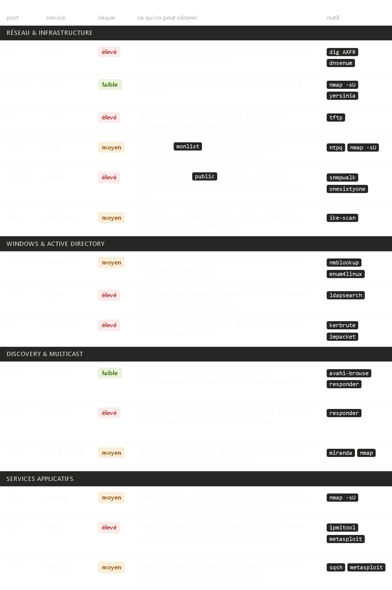
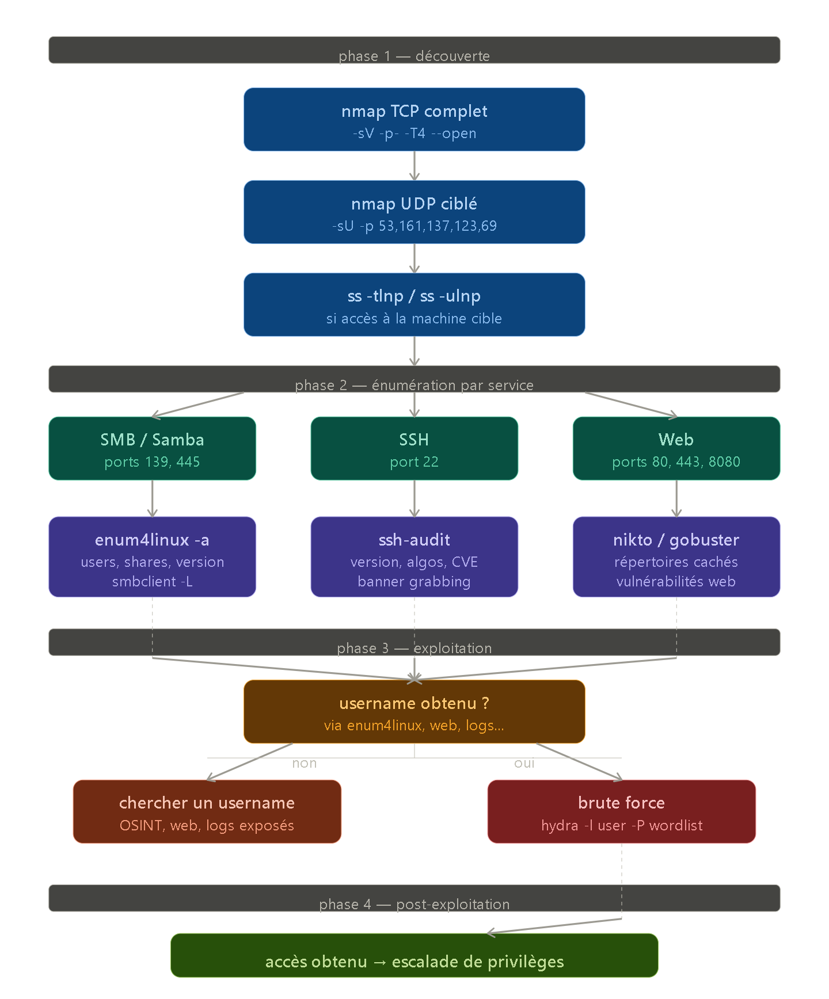

# checker UDP


 par défaut **nmap scanne uniquement TCP**.

Pour scanner UDP :

```bash
nmap -sU 192.168.78.131
```

- `-sU` — **UDP scan**

---

Mais il y a un problème pratique avec UDP — c'est **beaucoup plus lent** que TCP. Un scan UDP complet peut prendre 30 minutes voire plus.

Pourquoi ? TCP répond toujours — port ouvert = SYN/ACK, port fermé = RST. UDP lui ne répond pas forcément. Nmap doit attendre un timeout à chaque port pour savoir si c'est ouvert ou filtré.

---

Donc en pratique on cible les ports UDP intéressants directement :

```bash
nmap -sU -p 53,67,68,123,137,138,161,5353 192.168.78.131
```

Plutôt que scanner les 65535 ports UDP un par un.

---

**Donc pour être complet sur une cible, tu fais toujours les deux :**

```bash
nmap -sV -p- 192.168.78.131          # TCP complet
nmap -sU -p 53,137,138,161 192.168.78.131   # UDP ciblé sur les ports dangereux
```

C'est ça une reconnaissance sérieuse.


---



Les ports **LLMNR (5355)** et **SNMP (161)** sont les deux que tu croiseras le plus souvent en pratique — ce sont des classiques des labs TryHackMe et des CTF.

**IPMI (623)** c'est le plus violent — quand il est exposé sur un vrai serveur d'entreprise, c'est souvent game over direct.

**Kerberos (88)** c'est pour plus tard quand tu attaqueras des environnements Active Directory — pas encore pour ton lab Metasploitable.


---

## attaque:




